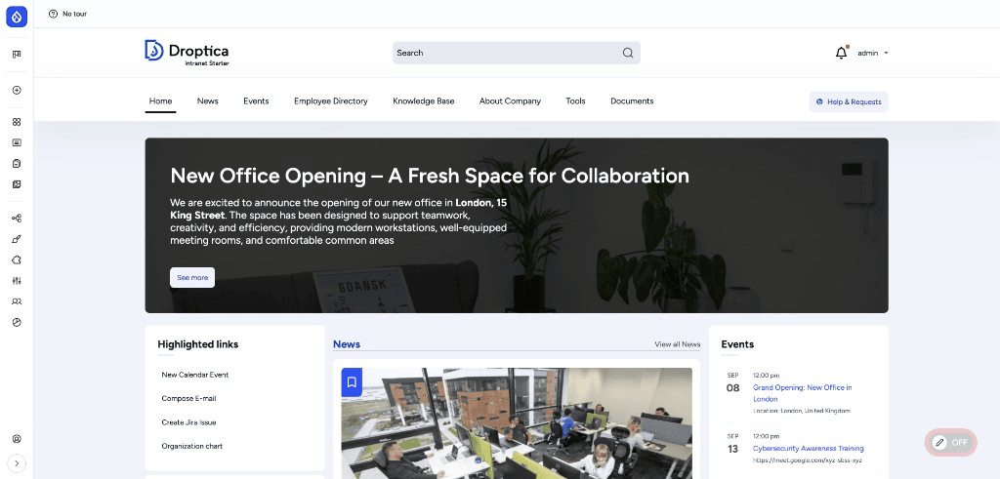
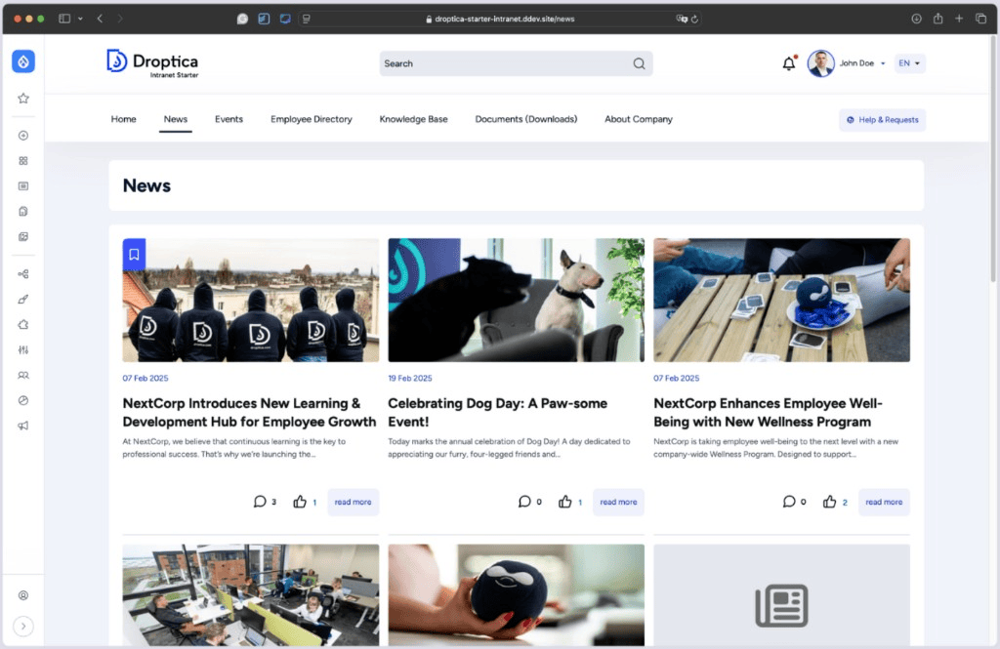
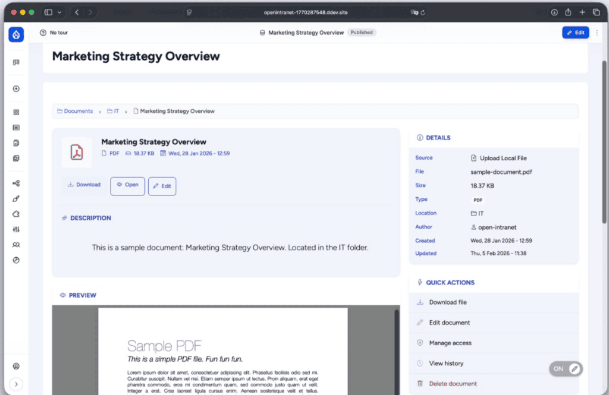
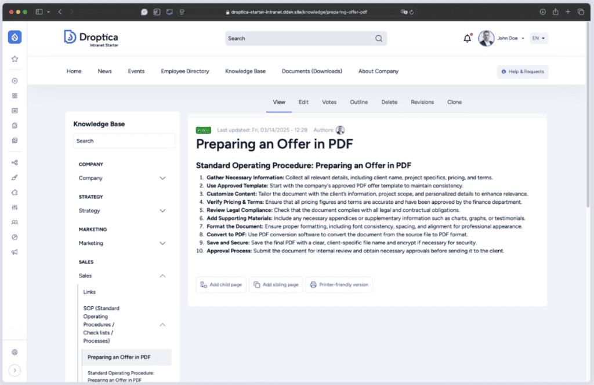
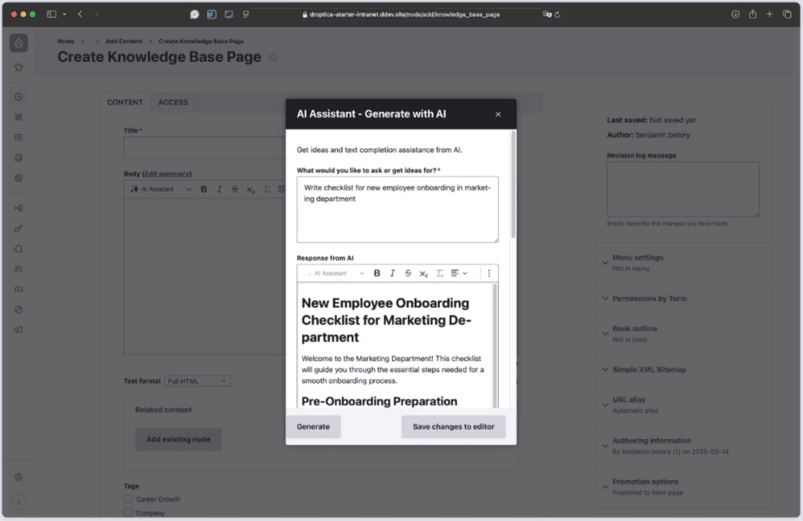
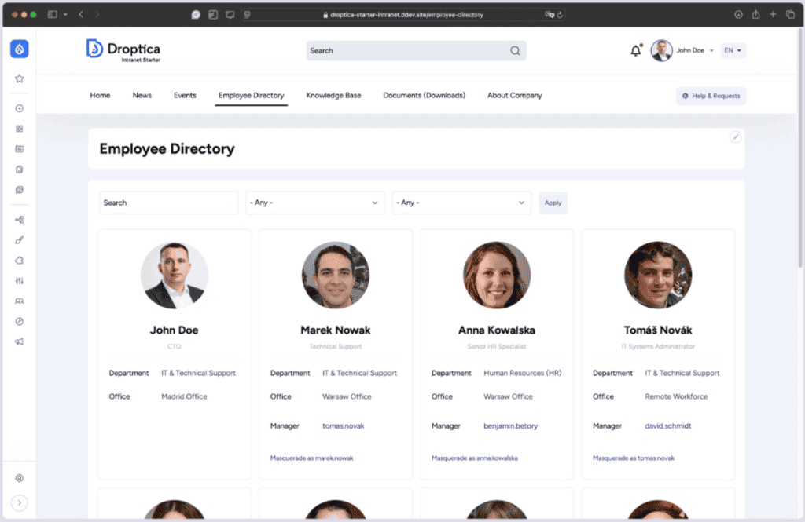

> [!IMPORTANT]
> **Development happens at [drupal.org/project/openintranet](https://www.drupal.org/project/openintranet).**
> File issues and submit patches there. This GitHub repo is a read-only mirror for visibility — pull requests opened here are not merged.

<div align="center">

# Open Intranet

**Open Source Intranet You Actually Own.**

Drupal 11 distribution for internal communication, knowledge management, and employee engagement. No per-user fees. No vendor lock-in.

[](https://www.gnu.org/licenses/old-licenses/gpl-2.0.html)
[](https://www.drupal.org/project/openintranet)
[](https://www.drupal.org/project/issues/openintranet)
[](https://www.php.net/)

[Website](https://open-intranet.com) · [Documentation](https://open-intranet.com/docs) · [Drupal.org project](https://www.drupal.org/project/openintranet) · [Issue queue](https://www.drupal.org/project/issues/openintranet) · [Request demo](https://www.droptica.com/products/intranet/)

</div>

---



## Why Open Intranet

- **Own the source code, infrastructure, and your data.** GPL-2.0-or-later, deploy anywhere — on-prem, private cloud, or any PHP host.
- **No per-user fees.** Self-host without seat-based pricing or vendor lock-in.
- **Built on Drupal 11.** Battle-tested CMS used by governments, banks, universities, and Fortune 500 companies worldwide.
- **Production-ready.** Used in real enterprise and public sector deployments — from 50-person teams to 7,000+ user organizations.
- **Customizable to the bone.** Extend, theme, and integrate without limits. No "premium tier" walls.

## Features

### News & Communications

- **News & Announcements** — Share company updates with rich content, media, and scheduled publishing
- **Must-Read posts** — Mandatory content with read confirmations for compliance and policy rollouts
- **Targeted distribution** — Right message to the right people; no more email flooding
- **Events Calendar** — Schedule and manage company events with RSVPs
- **Comments & Reactions** — Built-in social interactions on every piece of content
- **Peer recognition (Kudos)** — Reward and celebrate teammates publicly
- **Multi-channel notifications** — Reach users via email and SMS, including external contacts

### Knowledge Management

- **Knowledge Base** — Hierarchical Book-style documentation with full revision history
- **Wiki-style pages** — Collaboratively edited pages with diff and rollback
- **AI-assisted authoring** — In-editor content suggestions powered by OpenAI through Drupal AI + CKEditor integration
- **AI agents** — Automate repetitive content tasks via the Drupal AI Agents framework
- **Recently-read tracking** — Personalized continue-where-you-left-off views
- **Glossary & internal links** — Curate a single source of truth for company terminology

### Document Management

- **Document library** — Store, version, and share company documents
- **Granular file permissions** — Per-file and per-folder access control
- **Private files with download permissions** — Enforce ACLs on direct downloads
- **Media library** — Reusable images, videos, and embeds across content
- **CKEditor with media resize** — In-place editing of attached media

### People & Teams

- **Employee directory** — Searchable staff listing with rich profiles
- **Organization chart** — Interactive org tree showing reporting lines
- **Groups & spaces** — Departments, projects, and ad-hoc team areas
- **Frontend editing** — Edit content in place without admin UI roundtrips
- **Profile pages** — Skills, contact info, and personal updates per user

### Integrations

- **OpenID Connect SSO** — Sign in via Keycloak, Azure AD, Okta, Google Workspace; ready-to-use Keycloak recipe included
- **SMS gateway** — Send notifications via SMSAPI and compatible providers
- **Apache Solr** — Drop-in enterprise search backend (`search_api_solr`)
- **Calendar views** — Internal events with Calendar View and FullCalendar
- **REST / JSON:API** — Build mobile apps, dashboards, and custom integrations on top of Drupal core APIs
- **ECA workflow automation** — No-code event–condition–action automations

### Admin & Compliance

- **Role-based access control** — Drupal's mature permission system, refined for intranet use
- **Content revisions & history** — Built-in versioning, diff and rollback for every edit
- **Adoption analytics** — RFV scoring, active users, and segment health out of the box
- **Auto-logout & session control** — Configurable idle timeouts
- **Backup & migrate** — Built-in tooling for scheduled backups
- **Masquerade** — Support staff can troubleshoot as another user safely
- **GDPR-friendly** — Data export and account deletion flows out of the box
- **Multilingual** — Full i18n with translation workflows for 100+ languages

## Easily extensible with thousands of Drupal modules

Open Intranet is built on Drupal 11, so you can drop in any of the **40 000+ contributed modules** on [drupal.org](https://www.drupal.org/project/project_module) without touching the distribution. A few popular ones that fit intranet use cases:

| Need | Drupal module |
| --- | --- |
| LDAP / Active Directory sync | [`ldap`](https://www.drupal.org/project/ldap) |
| SAML 2.0 SSO | [`samlauth`](https://www.drupal.org/project/samlauth) / [`saml_sp`](https://www.drupal.org/project/saml_sp) |
| Vector / RAG search on top of the Drupal AI suite | [`ai`](https://www.drupal.org/project/ai) (`ai_search` submodule) |
| Two-factor authentication | [`tfa`](https://www.drupal.org/project/tfa) |
| Password policy & expiration | [`password_policy`](https://www.drupal.org/project/password_policy) |
| Audit log of user actions | [`audit_log`](https://www.drupal.org/project/audit_log) / [`watchdog_external`](https://www.drupal.org/project/watchdog_external) |
| GDPR consent & cookie compliance | [`gdpr`](https://www.drupal.org/project/gdpr), [`eu_cookie_compliance`](https://www.drupal.org/project/eu_cookie_compliance) |
| Migrate content from SharePoint / Confluence / legacy intranets | [`migrate_plus`](https://www.drupal.org/project/migrate_plus), [`migrate_tools`](https://www.drupal.org/project/migrate_tools), [`feeds`](https://www.drupal.org/project/feeds) |
| Production email transport | [`mailgun`](https://www.drupal.org/project/mailgun), [`sendgrid_integration`](https://www.drupal.org/project/sendgrid_integration), [`symfony_mailer`](https://www.drupal.org/project/symfony_mailer) |
| Slack / Teams / webhook notifications | [`slack`](https://www.drupal.org/project/slack), [`webhooks`](https://www.drupal.org/project/webhooks) |
| Mobile app / OAuth2 server | [`simple_oauth`](https://www.drupal.org/project/simple_oauth), [`jsonapi_extras`](https://www.drupal.org/project/jsonapi_extras) |
| CRM connector | [`webform_civicrm`](https://www.drupal.org/project/webform_civicrm), [`hubspot`](https://www.drupal.org/project/hubspot) |
| Real-time chat / messaging | [`message`](https://www.drupal.org/project/message), [`private_message`](https://www.drupal.org/project/private_message) |
| Spam protection & rate limiting | [`honeypot`](https://www.drupal.org/project/honeypot), [`flood_control`](https://www.drupal.org/project/flood_control) |
| SEO & internal redirects | [`metatag`](https://www.drupal.org/project/metatag), [`redirect`](https://www.drupal.org/project/redirect) |

> [!NOTE]
> The above modules are **not bundled** with Open Intranet. Add them via Composer (`composer require drupal/<module>`) and enable as needed.

## Quick Start

The fastest path — DDEV one-liner that handles everything:

```bash
curl -sL https://intranet.new/install.sh | bash
```

Or install manually:

```bash
git clone https://git.drupalcode.org/project/openintranet.git
cd openintranet
./launch-intranet.sh
```

After the launch script finishes, install the site either in your browser (`ddev launch`) or from the command line:

```bash
ddev drush site-install openintranet install_configure_form.enable_demo_content=1
```

> [!NOTE]
> Open Intranet is a Drupal **distribution**, not a Composer package. Use `git clone` or the DDEV one-liner above — there is no `composer create-project drupal/openintranet`.

Full installation guide: [open-intranet.com/docs/getting-started/installation](https://open-intranet.com/docs/getting-started/installation)

## Screenshots

<table>
  <tr>
    <td></td>
    <td></td>
  </tr>
  <tr>
    <td></td>
    <td></td>
  </tr>
  <tr>
    <td colspan="2" align="center"></td>
  </tr>
</table>

## Tech stack

- **Drupal 11.3+** — Core CMS framework
- **PHP 8.3+** — With strict types and modern language features
- **MySQL 8 / MariaDB 10.6+ / PostgreSQL 16+** — Choose your database engine
- **Composer** — Dependency management and installation
- **Drush 13+** — Command-line interface
- **Apache Solr** (optional) — Enterprise search backend
- **DDEV** (optional) — Containerized local development

## Contributing

Development happens on **drupal.org**, not GitHub. To contribute:

1. **Issues** — Open and discuss tickets in the [drupal.org issue queue](https://www.drupal.org/project/issues/openintranet).
2. **Patches & merge requests** — Submit through [drupal.org issue forks](https://www.drupal.org/docs/develop/git/using-gitlab-to-contribute-to-drupal/creating-issue-forks). GitHub pull requests are **not** merged.
3. **Discussions** — Join the conversation in the [Drupal Slack](https://www.drupal.org/slack), channel `#open-intranet`.
4. **Source repository** — [git.drupalcode.org/project/openintranet](https://git.drupalcode.org/project/openintranet)

This GitHub repository is a read-only mirror to give the project visibility on GitHub. All commits flow from drupal.org → GitHub one-way.

## Maintainers

Open Intranet is built and maintained by [**Droptica**](https://www.droptica.com) — a Drupal agency since 2011.

- Project website: [open-intranet.com](https://www.open-intranet.com)
- Project page on Drupal.org: [drupal.org/project/openintranet](https://www.drupal.org/project/openintranet)


## License

[GNU GPL v2 or later](https://www.gnu.org/licenses/old-licenses/gpl-2.0.html) — see [LICENSE.txt](https://git.drupalcode.org/project/openintranet/-/blob/HEAD/LICENSE.txt) on drupal.org.

## About

Built and maintained by [**Droptica**](https://www.droptica.com) — a Drupal agency since 2011.

We build solid open source solutions for ambitious companies: corporations, SMEs, startups, universities, and government.
